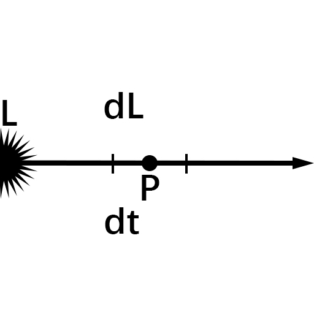

# 物理世界
+ ## PBR
+ ## 光线追踪，路径追踪与光线投射
+ ## 体渲染
  + ### 数学原理
    + #### 参与介质
      + 能让光穿透的物体：烟，云，玉，果冻等
    + #### 传输方程的分量
      + ##### 吸收(absorption)
        在介质中光转化其他形式的能量
      + ##### 外散射(out-scattering)
        光在介质中被散射到其他的方向了
      + ##### 自发光(emssion)
        介质其他形式的能转化成光能
      + ##### 内散射(in-scatterin)
        其他方向来的光打在介质粒子上恰好散射到视角方向上
    + #### 传输方程
      考虑一条沿着$\omega$方向行进的光线，在其上任取一点$P$，步长为$dt$,光线在经过$P$之前亮度为$L$，通过$P$点之后，获得增量$dL$
      
      + ##### 吸收(absorption)
        $dL=-\sigma_a*L*dt$
        其中:$\sigma_a$为absorption coefficient[系数]
      + ##### 
  + ### SDF
  + ### RayMarching
  + ### 体积光
+ ## 体积云渲染
+ ## 水体渲染
+ ## 毛发模拟
+ ## 屏幕空间反射
+ ## 渲染加速与性能优化
+ ## 皮肤渲染