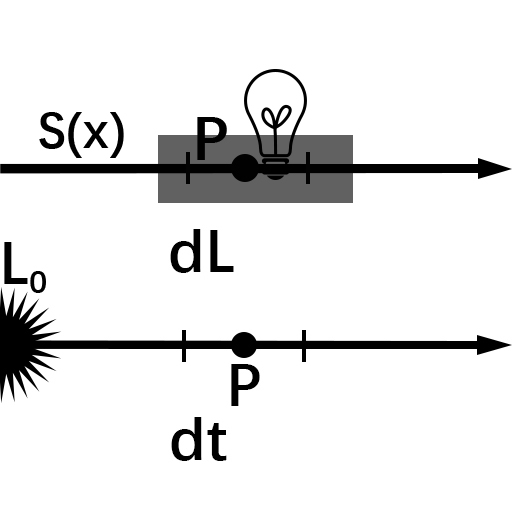

# 物理世界
+ ## PBR
+ ## 光线追踪，路径追踪与光线投射
+ ## 体渲染
  + ### 数学原理 
    + #### 参与介质
      + 能让光穿透的物体：烟，云，玉，果冻等
    + #### 传输方程的分量
      + ##### 吸收(absorption)
        在介质中光转化其他形式的能量
      + ##### 外散射(out-scattering)
        光在介质中被散射到其他的方向了
      + ##### 自发光(emssion)
        介质其他形式的能转化成光能
      + ##### 内散射(in-scattering)
        其他方向来的光打在介质粒子上恰好散射到视角方向上
    + #### 传输方程
      考虑一条沿着$\omega$方向行进的光线，在其上任取一点$P$，步长为$dt$,光线在经过$P$之前亮度为$L$，通过$P$点之后，获得增量$dL$
      
      + ##### 吸收(absorption)
        $dL=-\sigma_a*L*dt$
        其中:$\sigma_a$为absorption coefficient[系数]
      + ##### 外散射(out-scattering)
        $dL=-\sigma_s*L*dt$
        其中:$\sigma_s$为scattering coefficient[系数]
        说明L的亮度越大，光线被吸收和外散射的能量也就越大
      + ##### 自发光(emission)
        $dL=L_e*dt$
        表明自发光不受入射光线亮度影响
      + ##### 内散射(in-scattering)
        
        $dL=(\sigma_s \int\limits_{\Omega}p(\omega_i\rightarrow\omega)L_i d\omega_i)*dt$
        其中:$\sigma_s$一样是散射系数，而$p(\omega_i\rightarrow\omega)$为相位函数(Phase Function),表示$\omega_i$方向射入的光线散射到$\omega$方向上的概率密度。
        相位函数一般使用的是Henyey-Greenstein phase function
        + ###### 相位函数
          $p(\omega_i\rightarrow{\omega}')$表示$\omega_i$方向射入的光散射到${\omega}'$方向上的概率密度。即为球面上的概率密度函数，满足球
          面积分为1。
          $\int\limits_{\Omega}p(\omega_i\rightarrow{\omega}')d{\omega}'=1$
          可以将多个Phase加权平均，得到新的Phase function:
          $p(\omega_i\rightarrow{\omega}')=\sum\limits_{i=1}^{n}w_i*p_i(\omega_i\rightarrow{\omega}')$
          其中$\sum\limits_{i=1}^{n}w_i=1$
          在各向同性(isotropic)介质中，$p(\omega_i\rightarrow{\omega}')$的值仅仅依赖$\omega_i$和$\omega$的夹角，常记作$p(cos\theta)$
          比较常用的Phase function是Henyey-Greenstein phase function:
          <font size=5>$P_{HG}(cos\theta)=\frac{1}{4\pi}*\frac{1-g^2}{(1+g^2-2*g*cos\theta)^\frac{3}{2}}$</font>
          当g>0时，前向散射
          当g<0时，后向散射
          多数介质同时存在前向和后向散射
      + ##### 传输方程
        吸收+外散射+自发光+内散射=传输方程

        $dL=-\sigma_a*L*dt-\sigma_s*L*dt+(\sigma_s \int\limits_{\Omega}p(\omega_i\rightarrow\omega)L_i d\omega_i)*dt$
        令
        $\sigma_t=\sigma_a+\sigma_s$
        $S=L_e+\sigma_s \int\limits_{\Omega} p(\omega_i\rightarrow{\omega})L_id\omega_i$
        传输方程写为:
        $\frac{dL}{dt}=-\sigma_t L+S$
        其中$\sigma_t$被称为attenuation coefficient
        S为自发光亮度和in-scattering亮度的和，称之为源项。
        $\sigma_t和S都是t的函数$
      + ##### 求特解，比尔定律，光学厚度
        非齐次一阶线性微分方程求解需要先求齐次一阶线性微分方程即需要先求解:
        <font size=5>$\frac{dL}{dt}=-\sigma_t(t)L$</font>
        其通解为:
        <font size=5>$L=Ce^{-\int{\sigma_t(t)dt}}=C'e^{-\int_{0}^{t}\sigma_t(x)dx}$</font>
        代入初值条件$t=0$时$L=L_0$解得$C'=L_0$所以:
        <font size=5>$L=L_0e^{-\sigma_tt}$</font>
        即光线穿越均匀的参与介质过程中，亮度呈现指数衰减，这就是比尔定律(Beer's Law)。
        习惯上记:
        <font size=5>$\tau(p(0)\rightarrow p(t))=\int_{0}^{t}\sigma_t(x)dx$</font>为光学厚度
        又记:
        <font size=5>$T_r(p(0)\rightarrow p(t))=e^{-\int_{0}^{t}\sigma_t(x)dx}=e^{-\tau(p(0)\rightarrow p(t))}$</font>
        由于指数函数的特点:
        $T_r$有：
        若$p'$在$p$和$p''$之间，则有$T_r(p\rightarrow p'')=T_r(p\rightarrow p')*T_r(p'\rightarrow p'')$
      + ##### 传输方程[非齐次一阶线性微分方程]求通解
        传输方程
        <font size=5>$\frac{dL}{dt}=-\sigma_t(t)L+S(t)$</font>
        传输方程为非齐次一阶线性微分方程，通解为:
        <font size=5>
        $L=e^{-\int{\sigma_t(t)dt}} *
        \int{S(t)e^{\int{\sigma_t(t)dt}}dt}+
        Ce^{-\int{\sigma_t(t)dt}}
        $
        利用常数变更法：
        $L=
        \int_{0}^{t}{S(x)e^{\int_{0}^{x}{\sigma_t(u)du}}*
        e^{-\int_{0}^{t}{\sigma_t(x)dx}}dx}+
        C'e^{-\int_{0}^{t}{\sigma_t(t)dt}}
        $
        $L=
        \int_{0}^{t}{S(x)e^{-\int_{x}^{t}{\sigma_t(u)du}}}+
        C'e^{-\int_{0}^{t}{\sigma_t(t)dt}}
        $
        $
        L=
        \int_{0}^{t}{S(x)T_r(p(x)\rightarrow p(t))}+
        C'T_r(p(0)\rightarrow p(t))
        $
        代入初值条件$t=0$时$L=L_0$解得$C'=L_0$所以:
        传输方程的解为
        $
        L=
        \int_{0}^{t}{S(x)T_r(p(x)\rightarrow p(t))}+
        L_0T_r(p(0)\rightarrow p(t))
        $
        </font>
        <font size=5>①:$L_0T_r(p(0)\rightarrow p(t))$</font>表示从$P(0)$处的输入亮度$L0$经过$T_r(p(0)\rightarrow p(t))$衰减之后
        的亮度
        <font size=5>②:$\int_{0}^{t}{S(x)T_r(p(x)\rightarrow p(t))}$</font>表示$p(x)$处的自发光与内散射亮度之和$S(x)$经过
        $T_r(p(x)\rightarrow p(t))$衰减后的亮度，由于从$p(0)$到$p(t)$上各点都产生自发光和内散射，所以对0到t
        积分
        
        ### 参考文章:https://zhuanlan.zhihu.com/p/56710440
  + ### SDF 有向距离场
    + #### 运算空间:世界坐标空间
    + #### 获取摄像机世界空间射线方法:
      + ##### 冯乐乐利用13.3章全局雾效重建世界坐标空间的方法
        利用Camera的Transform.forward,up,left计算视锥体的BL,BR,TL,TR[已经是世界空间]
        打包进矩阵中发送给shader[行优先] 
        [SetRow 设置行 脚本里采用的是列优先所以直接使用SetRow]
        VertexShader通过判断UV的区域选则不同的index取对应的视锥体向量
        ``` hlsl
                output.texcoord=input.texcoord;
                int index=0;

                if(input.texcoord.x<0.5&&input.texcoord.y<0.5)
                    index=0;
                else if(input.texcoord.x>0.5&&input.texcoord.y<0.5)
                    index=1;
                else if(input.texcoord.x>0.5&&input.texcoord.y>0.5)
                    index=2;
                else if(input.texcoord.x<0.5&&input.texcoord.y>0.5)
                    index=3;

                output.ray=viewFrustumVector4[(int)index].xyz;
        ```
    + #### SDF真正的计算
    ``` hlsl
     float sdBox(float3 p,float3 b){
        float3 d=abs(p)-b;
        return min(max(d.x,max(d.y,d.z)),0.0)+length(max(d,0.0));
      }

      float map(float3 p){
        float box=sdBox(float3(p.x-0.4,p.y-0.1,p.z-0.2),float3(0.2,0.52,0.2));
        return box;
      }
      
     float4 fragmentShader(Varyings input):SV_TARGET{
                
                float3 Ray=input.ray;
                float3 dir=normalize(Ray);

                float4 ret=float4(0,0,0,0);
                float t=0;
                for(int i=0;i<64;i++){
                    float3 p=_WorldSpaceCameraPos+dir*t;
                    float d=map(p);
                    if(d<0.001){
                        ret=float4(0.5,0.5,0.5,1);
                        break;
                    }
                    t+=d;
                }

                
                return ret;
      }
    ``` 
  + ### RayMarching
  + ### 体积光
+ ## 体积云渲染
+ ## 水体渲染
+ ## 毛发模拟
+ ## 屏幕空间反射
+ ## 渲染加速与性能优化
+ ## 皮肤渲染

